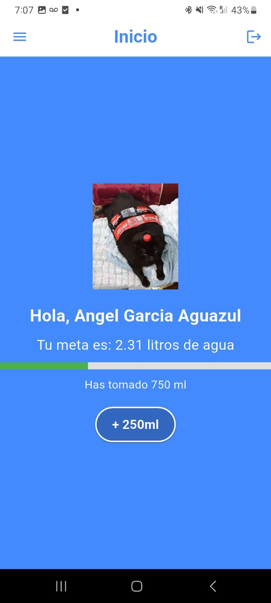

# 💧 Wabi — Water Consumption Management & Control App

**Wabi** is a mobile application developed in **Flutter** with the purpose of helping people **improve their water consumption habits** and, as a result, **enhance their health and well-being**.  
It allows users to record, monitor, and maintain daily control of their personal water intake, providing feedback through **statistics, notifications, and motivational rewards**.

---

## 📱 Screenshots

<table>
  <tr>
    <td align="center">Login / Sign Up</td>
    <td align="center">Personal Data</td>
    <td align="center">Daily Progress</td>
  </tr>
  <tr>
    <td></td>
    <td></td>
    <td></td>
  </tr>
</table>

<table>
  <tr>
    <td align="center">Progress & Streaks</td>
    <td align="center">Notifications</td>
    <td align="center">Rewards</td>
  </tr>
  <tr>
    <td></td>
    <td></td>
    <td></td>
  </tr>
</table>

---

## 🎯 Overview

Wabi is designed to promote **healthy hydration habits**, allowing each user to establish a **personalized water intake goal** based on their physical characteristics and activity level.  
The app guides users through **records, notifications, and visual rewards** to maintain consistency and achieve their daily hydration goals.

---

## 🧩 Main Features

### 🔐 User Authentication
- Register and log in using email and password.  
- User-friendly and secure interface for new users.  
    
  

### 🧍‍♂️ Personal Data Registration
- Users can input their **age, height, weight, and physical activity level**.  
- Based on this data, the app calculates a **personalized daily water intake goal**.  
  

### 💧 Daily Water Tracking
- Users can **log every drink** throughout the day.  
- Displays **daily progress** toward the target goal.  
  

### 📅 Progress Tracking & Statistics
- View progress through an interactive **chart and daily calendar**.  
- Check streaks and compare performance across days.  
  

### 🔔 Notification Module
- Users can customize:
  - 🕒 The time range to receive reminders.
  - 📱 Notification channels: smartphone, smartwatch, or both.
- Keeps hydration habits consistent throughout the day.  
  

### 🐶 Reward System
- Maintain hydration streaks to unlock **virtual pets**.  
- Each pet symbolizes consistency and motivation to stay hydrated.  
    
  

---

## ⚙️ Technologies Used

| Technology | Description |
|-------------|-------------|
| **Flutter** | Cross-platform mobile app development framework. |
| **Dart** | Main programming language of the project. |
| **Firebase** | Authentication, database, and push notifications. |
| **Provider** | State management solution. |
| **Charts & Calendar packages** | Data visualization for charts and calendars. |

---

## 🚀 Installation

1. Clone the repository:
   ```bash
   git clone https://github.com/yourusername/wabi.git
